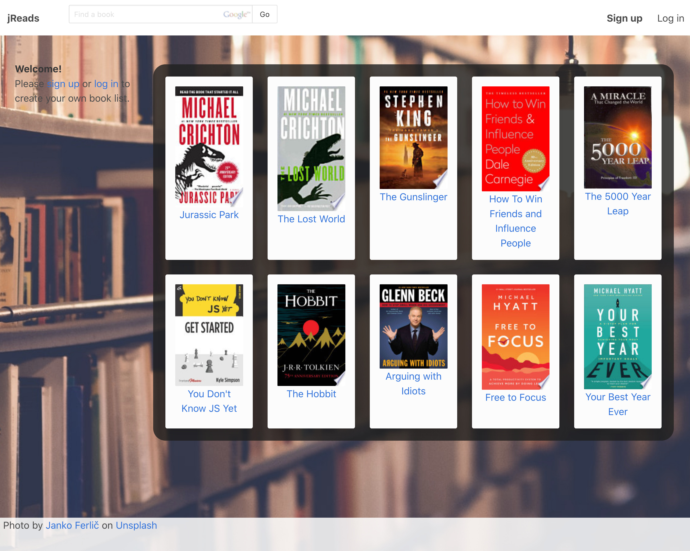

<!-- PROJECT LOGO -->
 

  <h1 align="center">jReads</h1>

  

    Track and Discuss Your Books
     
  

<!-- TABLE OF CONTENTS -->

  
Table of Contents

  <ol>
    <li>
      <a href="#about-the-project">About The Project</a>
      <ul>
        <li><a href="#built-with">Built With</a></li>
      </ul>
    </li>
    <li><a href="#contact">Contact</a></li>
    <li><a href="#acknowledgements">Acknowledgements</a></li>
  </ol>

<!-- ABOUT THE PROJECT -->
## About The Project

Reading personal growth and fiction books have been a big part of my life.  Inspired by [goodreads](https://www.goodreads.com/), jReads is for multiple users to track and discuss books they have read.

Areas of focus:

<ul>
  <li>Creating an API to interact with any database API</li>
  <li>User authentication</li>
  <li>Managing user comments</li>
  <li>Unit testing</li>
  <li>RESTful routes</li>
</ul>

Creating an abstract layer to interact with the database API and the jReads code was the step I was most exicted about.  I went into it with the mindset of using MongoDB now and being able to swap it out with a SQL database in the future.

For the book data used, I wanted manage a user's stored book data in a local database while making it easy to add new titles to a library.  The books and data are initially searched for and found using the Google Books API.  Any books a user adds to their own library are then saved to a seperate database for easy reference in the future.

### Built With

This section should list any major frameworks that you built your project using. Leave any add-ons/plugins for the acknowledgements section. Here are a few examples.
* [JavaScript](https://www.ecma-international.org/technical-committees/tc39/)
* [Node.js](https://nodejs.org)
* [Express](https://expressjs.com)
* [Passport](http://passportjs.org)
* [MongoDB](https://mongodb.com)
* [Bulma](https://bulma.io)

## Challenges

### Pooling Connections
I discovered while learning MongoDB that many blogs teach you how to incorporate Mongo into your project, but they skim over how to optimize the performance.  Shortly after finishing the interface for the Mongo API, the opened connections to Mongo went sky high with low user traffic.  After a morning of research, I came to the conclusion that a connection pool was needed and went forward with the implementation.  I found that making this change reduced the number of connections and also increased the speed of the website.

<!-- CONTACT -->
## Contact

Jake Simmens - [LinkedIn](https://linkedin.com/in/jakesimmens) - jake@jakesimmens.com

<!--Project Link: [http://jakesimmens.com](http://jakesimmens.com) -->

<!-- ACKNOWLEDGEMENTS -->
## Acknowledgements
* [Emerson Doyah](https://github.com/emerzonic) - Knowledge of testing
* [Othneil Drew](https://github.com/othneildrew/Best-README-Template) - Readme template
* [bcrypt](https://www.npmjs.com/package/bcrypt) - Hash and salt
* [Jest](https://jestjs.io/) - testing
